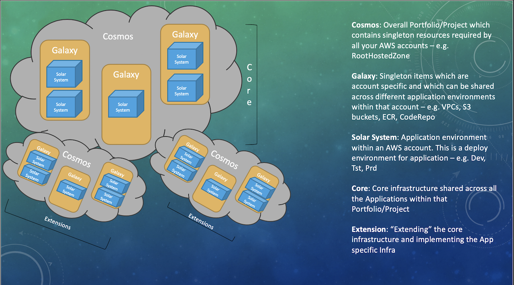

# What is CDK Cosmos?

CDK Cosmos is a collection of libraries and patterns created using AWS CDK. It encapsulate common patterns and practices followed in enterprises to create infrastructure in AWS. Many organisations use different implementations of AWS design patterns for example to achieve high availability, disaster recovery, security, AWS Organisations etc. Cosmos tries to use those pattern to setup your AWS infrastructure portfolio. It simplifies complex component infrastructure and wraps them into higher level constructs.

For more information on AWS-CDK, checkout the official documentations from AWS [here](https://docs.aws.amazon.com/cdk/latest/guide/home.html).

## Cosmos repositories

Cosmos project is divided into following repositories:

- [cosmos](https://github.com/cdk-cosmos/cosmos) - Cosmos Package
- [cosmos-core-cdk](https://github.com/cdk-cosmos/cosmos-core-cdk) - Template for Cosmos Core Cdk App
- [cosmos-extension-cdk](https://github.com/cdk-cosmos/cosmos-extension-cdk) - Template for Cosmos Extension Cdk Apps

## Basic Understanding

Cosmos is broken down into 3 scopes (Bubbles)

- **Cosmos**: Top level scope of the entire infrastructure, mostly singleton shared resources.
- **Galaxy**: Account level scope that defines infrastructure for an aws account.
- **SolarSystem**: Environment level scope that defines infrastructure for an environment with in an aws account (Dev, Tst, Prd).

