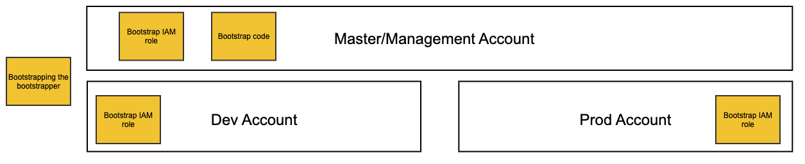

This template is flavoured for ECS and the walkthrough will deploy a Hello World node app.

The bootstrapper is a package included in Cosmos Core building blocks that extends the AWS CDK toolkit with additional functionality to make deploying a Cosmos core or extension easier. The Cosmos CDK Toolkit includes, in addition to an s3 bucket for staging assets, a CodeBuild project that deploys your CDK. Because this deploy project runs in AWS as opposed to on your local workstation, the necessary roles are already configured for you.

The easiest way to get started with Cosmos is to use a template. Currently there are templates for the following patterns:
- [Cosmos Core CDK ](https://github.com/cdk-cosmos/cosmos-core-cdk)

_When to use extension template vs core template - does extension reinstall core or do you have to install core first either way?_

If you're not sure what you'll need or can't see a template that suits your needs, the Cosmos Core CDK template will give you a blank template, to which you can add more features once you have bootstrapped the initial project. Clone one of those templates to your local machine and run `npm install`

### Edit bin/main.ts 
This is where you will identify the accounts in the Cosmos pattern, e.g. mgt, dev, prod, and configure the needed resources.
1. Complete the configuration objects with your account numbers and regions
2. Change the project name from `Demo` to the name of your Core
3. Replace the TLD (top level domain) with the correct one for your project
3. Add the appropriate CIDR ranges

### Bootstrap the bootstrapper
At this point you have reached the minimal requirements to bootstrap your Cosmos Core. We don't recommend adding any further resources until the bootstrapping process is complete. _You will need to bootstrap the master account first, commenting out the other accounts in main.ts to avoid errors_

When bootstrapping the bootstrapper, you will need to be using an IAM role able to create and edit policies.

Important note for local development: If you get an error in this step, you may need to set
`export CDK_COSMOS_CREDENTIALS_PLUGIN_DISABLE=true`

(^plugin assumes roles when in AWS, but when working locally you use your own credentials)

Any Other Prerequisites?
- AWS CLI?

_Copy across details from readme_

#### What you have now
This is the initial step required to deploy Cosmos into your AWS accounts. At this point, you will have a bootstrap Code Build project in your master account (s3 bucket), and a bootstrap IAM role in each account (including master). This role will be used to bootstrap your Cosmos core or extension. 

Please note that these accounts are created outside of your Cosmos stacks, as they are used to deploy the stacks. Therefore, if you delete Cosmos stacks in future, these roles will remain in the accounts unless manually deleted.

_Sample Pattern with Management, Development & Production Accounts:_

## [Next Step: Deploying Cosmos Core](getting_started_core.md)

***
