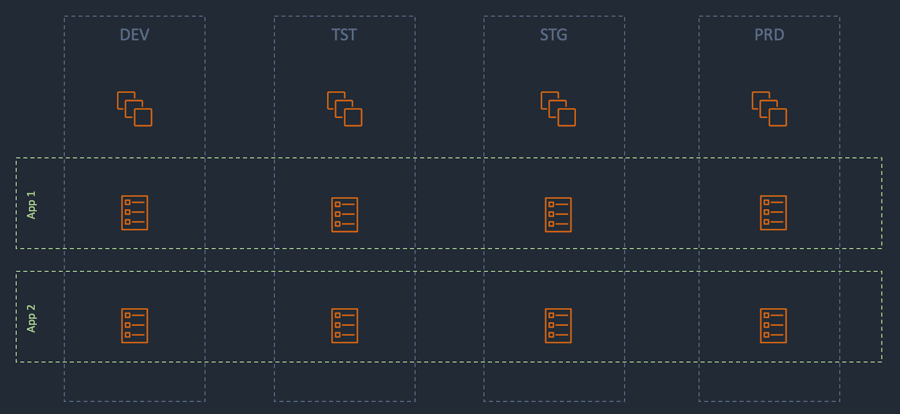
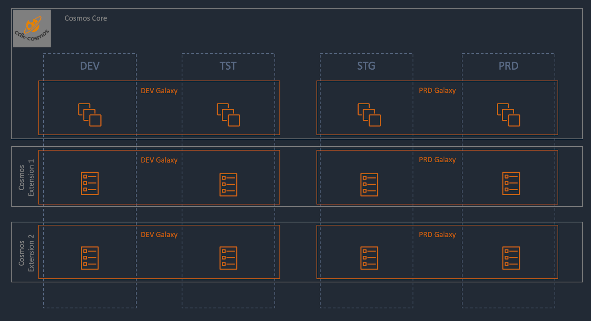

## Understanding the Cosmos

To understand the cosmos, we should first start with a basic enterprise architecture. Generally enterprise environments want to have isolated locations to deploy applications and services. These environments, which we call App Envs or SolarSystems, are generally labelled dev, tst, stg, or prd. As we move from left to right, the importance and severity of these applications and services increases. Thus we want to work out all the bugs before we deploy to Production, deploying fewer bugs as we move from left to right. Our way of working should also reflect this, from Pipelines to Availability. The cosmos is centred around this design and idea.

### Basic Architecture

Lets start with a basic enterprise architecture. Here we can see that there are 4 app environments. In Each environment there are docker hosts and containers. The containers are owned by the Applications and the docker hosts are owned by shared infrastructure.

### Cosmos Architecture

In cosmos we can express the same idea with 5 Concepts: 2 owner constructs (Core, Extension), and 3 organisational constructs (Cosmos, Galaxy, SolarSystem).

#### Owner Constructs

The owner constructs are ideas around who owns the AWS infrastructure.

The Core is shared infrastructure. Things like Clusters and ALB's are shared resources that can consumed by applications (Extensions).

An Extension is infrastructure owned by an "Application". Things like Containers, Code Repo, and Databases are resources that shouldn't be shared and thus other applications should not consume them.

#### Organisational Constructs

The organisational constructs are ideas around organising resources, especially considering singleton resources and cross account resources.

The Cosmos is the root construct that contains resources that you only want to create once and use thoughout Cosmos Galaxies and SolarSystems. This concept potentially spans across multiple AWS accounts (Galaxies), but due to limitations in AWS, resources created at this level are created only in your root AWS account, which we generally refer to as the MGT Account.

The Galaxy is a construct that has a 1:1 relationship with AWS accounts. Here you can create resources that are required for the account to function, or resources that you might share among multiple SolarSystems within a single AWS account.

The SolarSystem is a construct that defines individual "Deployment Application Environments". This is the lowest organisational construct that the Cosmos supports. Here you can add Clusters (in the Core) and Containers (in the Extensions), etc. Each SolarSystem is designed to be conceptually isolated from other SolarSystems, but in some cases it may make sense to share layers like networking (for cost reasons).

The result of building the cosmos with multiple AWS accounts looks something like this.

